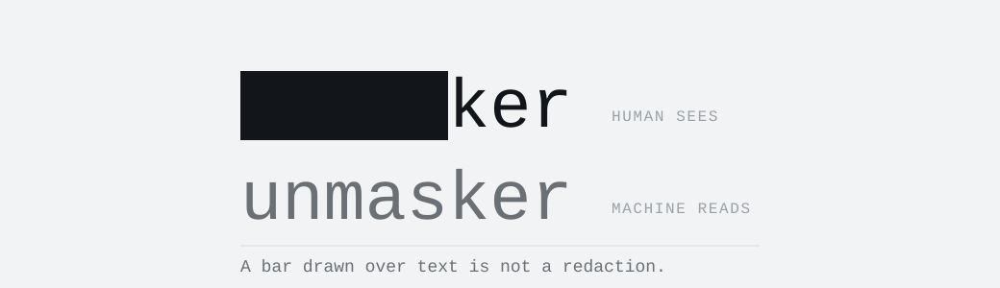

<a id="top"></a>

<div align="center">
  
  <p>
    
    
    
    
    
    
    <a href="https://github.com/osint-shifu/unmasker/actions/workflows/ci.yml"></a>
  </p>
  <p>
    <a href="#why">Why</a> ·
    <a href="#using-it">Using it</a> ·
    <a href="#what-it-finds">What it finds</a> ·
    <a href="#how-it-decides-what-to-say">How it decides</a> ·
    <a href="#how-it-is-tested">Testing</a> ·
    <a href="#what-it-does-not-do">Limits</a>
  </p>
</div>

---

A black rectangle drawn over text is not a redaction. The text is still in the
file and every parser reads it. `unmasker` reports each place the two layers
disagree — and says nothing beyond what it can show.

```console
$ unmasker leaked.pdf

  unmasker  leaked.pdf                                          4 findings
  ────────────────────────────────────────────────────────────────────────

  ● 22 characters under a black shape at x 117.5-268.7, y           page 1
    684.2-698.5; the rest of the line still reads "Name:"
  │ human sees     ██████████████████████
  │ machine reads  Wanda Testowa-Przyklad

  ● 21 characters under a black shape at x 114.8-259.3, y           page 1
    664.5-678.7; the rest of the line still reads "Email:"
  │ human sees     █████████████████████
  │ machine reads  w.testowa@example.org
```

Every finding names the two readings, where to look, and how the tool knows.
There are no verdicts: it does not say a document was manipulated, because
that is the reader's conclusion to draw and a tool that draws it has to be
trusted blindly.

## Why

The person redacting a document sees a black bar and believes the job is done.
It keeps happening in court filings and government releases, because the tool
that draws the bar does not remove what is under it.

The same reading serves two more uses. A PDF fed to a retrieval pipeline can
carry instructions a human reviewer will never see. And a leaked or altered
document can be checked: what did the tracked changes hold, whose name is in
the metadata, does the text layer agree with the picture.

## Using it

Not published anywhere yet, so it is installed from a checkout of this
repository:

```bash
python3 -m venv .venv
.venv/bin/pip install -e .
.venv/bin/unmasker document.pdf
```

Python 3.10 or later, and one runtime dependency — `pypdf`, which is pure
Python, BSD-licensed and has no dependencies of its own. It was checked rather than
assumed, and any second one has to earn its place the same way — in writing.

Reads PDF, DOCX, ODT, XLSX, ODS and any text file. Local, read-only, no
network, and it never writes to the file it is given.

Point it at a **folder** and it surveys the lot: how much was read, how much
could not be, which kinds of finding turned up and in how many files, and which
files to open next. The screen triages and `--json` carries every finding, so
there is no `--full` — the archive already exists.

`--html` writes a page somebody can be sent:

```bash
unmasker ~/cases/kowalski --html > report.html
```

One file, no external anything, no JavaScript, and print rules for the day it
goes into a case file. It carries the **full** detail rather than the survey's
summary — a browser has search and a scrollbar where a terminal has neither.

A redirect rather than an `--out` option, because this tool never writes
anything. Everything it quotes came out of a document somebody else wrote, so
every value on that page is escaped: a PDF whose metadata reads
`` would otherwise put a live handler into the report of
itself.

`--md` is the same report for somewhere that already speaks Markdown. It is
the **more** dangerous of the two to get wrong, not the safer: an HTML renderer
handed `<script>` prints it, and a Markdown renderer runs it, because passing
raw HTML through is what Markdown does. So quoted evidence goes in a fenced
block — with a fence grown longer than any run of backticks inside it — prose
is escaped, and a `|` never reaches a table cell unescaped.

It never ranks the files. Sorting the worst documents to the top would be the
judgement this tool leaves to its reader, so the tally counts files per kind
and the list is in path order.

Presentations — `.pptx` and `.odp` — are **refused**, with a message saying so.
Reading a deck as a text document would report a hidden slide and a speaker
note as visible text and then call the file clean, and saying less is better
than saying something untrue.

| | |
| --- | --- |
| `--json` | one object on stdout, for a pipeline that wants to sort or filter |
| `--html` | one self-contained page on stdout — redirect it into a file and send it |
| `--md` | Markdown on stdout, for a wiki, a ticket or a pull request |
| `--ocr` | render each page and read the picture back (see below) |
| `--width N` | wrap at N columns instead of measuring the terminal |

Exit status is **0** when nothing was found, **1** when there are findings, and
**2** when the file could not be read. Three rather than two, because a file
that could not be read is not a file that came back clean, and a pipeline that
cannot tell those apart will eventually wave through the one document it should
have stopped.

## What it finds

### On the page

| | |
| --- | --- |
| `covered-text` | text under a filled shape, reported per character — a bar dragged too short is reported as covering exactly what it covers |
| `text-under-image` | text under a picture, kept separate because a scan of a printed page looks the same and usually agrees with itself |
| `invisible-text` | text a render mode never paints, or an opacity that paints nothing — `color: transparent` is one CSS declaration and changes no render mode at all |
| `low-contrast-text` | text in the colour of what is behind it, whether that is a shape or the bare paper |
| `off-page-text` | text outside the visible page — a crop box smaller than the media box is how a "cropped" file keeps what was cropped off |

### In the characters

Works on anything that yields text, so it covers DOCX, HTML, Markdown and
source as well as PDF.

| | |
| --- | --- |
| `zero-width` | zero-width spaces, joiners, soft hyphens, word joiners |
| `bidi-control` | direction overrides — a filename written `invoice⟨U+202E⟩gpj.exe` in the file reads as `invoiceexe.jpg` on screen, and is an executable |
| `tag-characters` | plane-14 tag characters, decoded; the channel of choice for hiding instructions in text meant for a model |
| `mixed-script` | a single word spanning two scripts — Cyrillic `а` inside a Latin domain |

### In a spreadsheet

A row, a column or a whole sheet carries an attribute saying not to draw it,
and every value in it stays in the file exactly as typed. Someone selects three
columns, right-clicks, chooses Hide, and sends the workbook out believing the
numbers are gone.

| | |
| --- | --- |
| `hidden-sheet` | a sheet the workbook carries and never shows — and it says so louder when the sheet is marked `veryHidden`, which the application offers no way to undo |
| `hidden-rows` | rows nobody sees, collapsed into one finding per block, because hiding rows 10 to 40 is one act by one person |
| `hidden-columns` | the same by column, addressed the way the person who hid it saw it: `column D`, not an index |
| `filtered-rows` | rows a filter is holding back rather than a person having hidden them — a weaker claim, and reported as one |
| `changed-cell` | what change tracking took out of a cell and left in the file, with who changed it and when — the one finding here whose **both** columns carry text, because the current value is sitting in the cell |

A spreadsheet stores a date as `45366` and a price as `240000`. Dates are
rendered, because a date cell holds a count of days and the conversion is
exact. Everything else is quoted as the file stores it, with a note naming the
format the sheet applies — a number formatter that is nearly right quotes a
figure that is nearly right, which is worse than an exact quotation and a
sentence of context.

### In the container

| | |
| --- | --- |
| `deleted-text` | what a tracked deletion took off the page and left in the file, with who deleted it and when |
| `comment` | comments — in Word, in OpenDocument, and in a PDF where they are annotations hanging off the page that no text extraction reports |
| `revision-history` | one line naming who edited the file and when, never one finding per change |
| `undisclosed-metadata` | a name, a client, a codename or a classification the document's own text never shows |
| `metadata-path` | a filesystem path, which leaks a directory structure and usually an account |
| `metadata-conflict` | the file contradicting itself — a PDF states its metadata twice, and a tool that clears one copy and not the other leaves exactly that |

### By reading the page back

`--ocr` renders each page and reads the picture with an OCR engine. It needs
`ghostscript` and `tesseract`, and costs seconds a page, which is why it is not
the default.

| | |
| --- | --- |
| `unrendered-text` | words the file holds that the page does not show — **found without knowing how they are hidden** |
| `unextractable-text` | words the page shows that the file does not hold; the only finding here where the two columns swap |

Every other detector knows a trick, and each was written after a producer was
caught doing something particular. This one knows nothing, so a method nobody
has thought of still fails it. On the specimens the two approaches name the
same words on every file that hides text, and both stay silent on every
control — which is not something either could arrange for the other.

## How it decides what to say

**Colour encodes how the tool knows, never how bad it is.** Three classes,
learned once:

- **direct** — the bytes are in the file and were read out; nothing is inferred
- **circumstantial** — consistent with hiding, and with innocent explanations
  too. A word spanning two scripts may be an attack or may be how somebody
  writes; OCR failing to read text looks exactly like text not being there
- **self-reported** — the file's own account of itself. A name in a document is
  whatever the application that wrote it was configured to say

There are no scores. `55` reads as a probability and never was one; a word can
be argued with by the person reading the report, which is the point.

**Different questions are never ranked against each other.** A page can have a
bar over its text *and* an invisible character *and* stale metadata. Those are
three findings, not one winner.

**"Nothing found" has two meanings**, and the report keeps them apart. *Searched
and it is not there* is one. *There was nothing this tool could search* is the
other — a page with no text layer, or text sitting on a picture whose colour at
that point is not in the file. The second comes with a note saying so.

**Nothing is truncated.** A value too long for the line wraps. An ellipsis sends
the reader to fetch the value another way, which defeats having read the report.

## How it is tested

Every detector fires on a **committed specimen that a real producer wrote** —
LibreOffice, headless Chrome, Ghostscript, tesseract, exiftool, ImageMagick.
There are 18 of them and they are the test suite; each has a `.md` beside it
recording which tool made it, what a human sees when it is opened, and what is
actually inside.

That discipline is not decoration. The first specimen disproved the design:
LibreOffice draws a redaction bar as a polygon filled with `f*` and emits no
`re` at all, so the rectangle-based detector the plan called for would have
found **nothing** on the archetypal case — and a fixture built from the PDF
specification would have hidden that behind a green test suite.

Where a specimen needs a measurement — where a bar goes, how wide a glyph is —
it comes from **poppler**, not from this project's own code. A fixture measured
with the tool under test proves only that the tool agrees with itself.

Findings are also mutation-tested: each rule is broken on purpose and the suite
has to notice. That has repeatedly found behaviour the docstrings claimed and
nothing checked.

439 tests.

## What it does not do

- **No verdicts.** It will not tell you a document was manipulated.
- **No writing.** It never modifies the file it is given.
- **No network.**
- **Not every container.** Spreadsheets and presentations are unread; so are
  legacy OLE2, EXIF, and XMP outside a PDF. The sibling project `filetrail`
  reads several of those and answers a different question with them — where a
  file came from.
- **Not every producer.** Word and Acrobat are not on the machine this was
  built on, and two producers never agree about everything.
  [`tests/specimens/README.md`](tests/specimens/README.md) keeps the current
  list of what is untested and why.

## Further

- [`CONTRIBUTING.md`](CONTRIBUTING.md) — the rules this project works to, each
  one named after the failure that produced it
- [`tests/specimens/README.md`](tests/specimens/README.md) — the specimens, what
  each proves, and the gaps that are named rather than hidden
- the sibling project's design notes — the design language the report follows

## License

Apache License 2.0.
